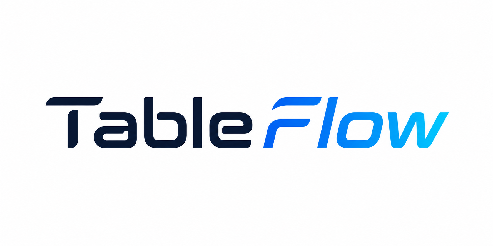

#  Tableflow

Tableflow is a modern, lightweight, multi-driver database administration GUI client built using Tauri, Rust, Vue 3, and Pinia. It delivers a fast, desktop-native experience for managing MySQL, PostgreSQL, and SQLite databases with security and flexibility.


## Features

- **Multi-Driver Adapter**: Supports MySQL, PostgreSQL, and SQLite under a single unified database connector abstraction.
- **Secure Connection Storage**: Stores connection configurations in local application data directory JSON files, while keeping connection passwords safely isolated in your operating system's native credential manager (macOS Keychain, Windows Credential Manager, Linux Secret Service) using the `keyring` library.
- **Connection Testing**: Test connection settings in real-time before saving, showing backend diagnostic warnings and error output.
- **Collapsible Database & Tables Tree**: Left sidebar displays active databases with a collapsible sub-table tree, loaded lazily from the active connection. Multiple databases can be opened and expanded simultaneously.
- **Dynamic Database Panel**: Right database panel lists all available databases under the active connection, allowing you to open/expand them on the left sidebar tree by clicking.
- **Modern UI/UX**: Preserves classic phpMyAdmin aesthetics but styled with modern Tailwind CSS tokens, HSL custom color schemes, responsive grid layouts, and zero inline CSS styling.

## Tech Stack

- **Frontend**: Vue 3 (Composition API), Pinia (State Management), Tailwind CSS v4, Monaco Editor
- **Backend (Tauri v2)**: Rust, sqlx (MySQL, PostgreSQL, SQLite), keyring-rs, tokio
- **Build / Tooling**: Vite, Cargo

## How to Run

### Prerequisites

Ensure you have the following installed:
1. **Node.js** (v18+)
2. **Rust & Cargo** (v1.75+)
3. Development packages for your OS (e.g. build-essential on Linux)

### Setup & Installation

1. Clone the repository.
2. Install npm dependencies:
   ```bash
   npm install
   ```

### Running in Development Mode

Launch the Tauri application in hot-reloading development mode:
   ```bash
   npm run tauri dev
   ```

### Building for Production

Compile the production desktop application binaries:
   ```bash
   npm run tauri build
   ```
